# Chat

Aplicação Laravel de chat em tempo real. Há autenticação, conversas individuais e grupos de texto, envio HTTP com persistência no MySQL `chat` e atualização ao vivo via Pusher Channels.

## Funcionalidades

### Nível 1

- **N1-01 — Lista pela última atividade.** Cada item mostra nome e prévia da última mensagem (incluindo “Mensagem removida” e “Imagem”). O e-mail permanece no cabeçalho da conversa individual, em linha própria abaixo do nome. A ordenação usa a data de **envio** (`created_at`), com desempate estável por ID; editar uma mensagem antiga não a promove. Contatos sem mensagens continuam na lista. A consulta de prévias e não lidas é agregada, sem N+1 por contato.
- **N1-02 — Atividade fora da conversa aberta.** Eventos no canal privado do usuário atualizam prévia e posição da lista mesmo com outra conversa aberta, inclusive envios próprios de outra aba. A conversa selecionada, o foco, o rascunho e o histórico atual são preservados. Mensagens recebidas são anunciadas uma vez. Após reconexão, a lista reconcilia por HTTP.
- **N1-03 — Compositor multilinha.** `textarea` com altura limitada e rolagem. No desktop, Enter envia e Shift+Enter quebra linha. No teclado virtual (breakpoint 735px ou ponteiro grosso), Enter não envia — o envio é pelo botão. Composição IME não dispara envio. Limite de 1000 caracteres, rascunhos e preservação do texto em erro. Sem JavaScript, o POST/redirect pelo botão continua válido.
- **N1-04 — URLs clicáveis.** Só `http://` e `https://` viram links (`target="_blank"` e `rel="noopener noreferrer"`). O restante do texto e os atributos são escapados. O mesmo critério vale no HTML inicial, no carregamento de mensagens anteriores e nos eventos ao vivo.

### Nível 2

- **N2-01 — Não lidas persistidas.** Badge numérico por usuário e conversa. Contam só mensagens recebidas e não removidas. A leitura é um `POST /leituras` autenticado até o último ID apresentado, com aba visível; `GET` não altera o marcador. O marcador é monotônico. Vale para individuais e grupos.
- **N2-02 — Indicador de digitação.** O backend publica quem está digitando, sem o rascunho. Frequência limitada (~2 s) e expiração (~3 s). O estado some ao enviar, trocar de conversa ou desconectar. **Não usamos whisper no canal individual:** esse canal só autoriza o próprio usuário. A digitação vai pelo mesmo canal privado de cada participante autorizado, mediada pelo servidor.
- **N2-03 — Editar e remover mensagem própria.** Só o autor com acesso à conversa. Edição com limite de 1000 caracteres e indicação “Editada”. Remoção para todos. Com JavaScript, a confirmação nativa (“Esta mensagem será removida para os participantes da conversa.”) ocorre antes do `DELETE`. Sem JavaScript, o primeiro “Remover” abre uma página de confirmação (GET, sem alterar dados) que identifica a mensagem, explica a remoção para os participantes e oferece **Confirmar remoção** e **Cancelar**. Cancelar volta à conversa com a mensagem intacta. Confirmar envia o `DELETE` uma vez. Placeholder “Mensagem removida”. Mensagem removida não volta a ser editada. Autorização no servidor.
- **N2-04 — Histórico em janelas.** Últimas 50 mensagens, ordem cronológica no servidor e no cliente (inclusive nos lotes anteriores). “Carregar mensagens anteriores” só aparece quando há página anterior; o atributo `hidden` é respeitado pelo CSS. Reconciliação por `versao` da conversa/mensagem: recupera mensagens novas e também edições/exclusões. Evento antigo não substitui estado mais novo.

### Nível 3

- **N3-01 — Grupos de texto.** Nome, criador e membros. O criador gerencia membros; participantes enviam. O remetente aparece no balão. Novos membros **podem consultar o histórico**; a interface avisa isso ao criar/adicionar. Membro removido perde histórico e eventos futuros, inclusive com conexão já aberta: a publicação vai só aos membros atuais, no canal privado de cada um.
- **N3-02 — Anexos de imagem no 1:1.** Uma imagem JPEG/PNG por mensagem, até 2 MB. Texto opcional se houver imagem. Disco **privado** (`storage/app/private/anexos`); a imagem sai por rota autenticada. Terceiro não abre pela URL. Mensagem removida torna o arquivo inacessível. O Pusher leva só metadados. Anexos em grupos ficam fora deste item.
- **N3-03 — Bloquear contato.** Quem bloqueia registra o bloqueio e só essa pessoa desbloqueia. Envio 1:1 e digitação param nos dois sentidos. Histórico anterior permanece. Gestão em `/profile`. O bloqueio individual **não** oculta mensagens em grupos. O canal `App.Models.User.{id}` não é desautorizado por causa de um bloqueio: a filtragem é na publicação e nas operações.

## Decisões

**Leitura.** O marcador `ultima_leitura_mensagem_id` vive em `conversa_participantes`. Só avança (nunca regride). A aba em segundo plano não chama `POST /leituras`. Contagens entre abas da mesma conta usam `localStorage`/`BroadcastChannel` depois da gravação.

**Digitação.** Evento `participante.digitando` publicado pelo backend nos canais privados dos outros participantes autorizados. Isolamento do canal individual preservado. Não depende de client events do Pusher.

**Exclusão.** Soft-delete (`removida_em`). Com JavaScript, `confirm` nativo antes do `DELETE`. Sem JavaScript, GET `/mensagens/{id}/confirmacao-remocao` (autorizado, sem mutação) e o `DELETE` só no “Confirmar remoção”. A prévia e as não lidas tratam a mensagem como removida. O arquivo físico é apagado depois da confirmação no banco; falha de limpeza só é registrada em log.

**Grupos.** Mesmo modelo de `conversas` (tipo `individual` ou `grupo`). Mensagens antigas 1:1 foram migradas para `conversa_id` sem trocar IDs, autoria, conteúdo nem datas. Eventos de grupo não usam um canal compartilhado cuja autorização vale só na assinatura: a lista de destinos é resolvida na hora do envio.

**Anexos.** Disco `anexos` sem `serve` público. Nomes gerados no servidor. Upload que falha na gravação da mensagem é limpo. `GET /mensagens/{mensagem}/anexo` confere autenticação, participação e mensagem não removida.

**Bloqueio.** Tabela `bloqueios`. Impede `enviar`/`digitar` na policy da conversa individual. Publicação 1:1 não entrega evento ao par bloqueado. Grupos ignoram o bloqueio individual, e a UI diz isso.

**Canais Pusher.** Continuam `App.Models.User.{id}` (privado, só o dono) e `presenca.chat` (presença global). Prefixo opcional `CHAT_PREFIXO_CANAL` isola testes do mesmo aplicativo Pusher.

**Lista ao vivo.** O cliente não descarta conversa desconhecida: só ignora IDs revogados (membro removido). Assim a primeira mensagem de um contato sem conversa prévia atualiza a lista.

**Servidor e2e.** `artisan serve` só honra `PHP_CLI_SERVER_WORKERS` com `--no-reload`. Sem isso, um GET paralelo a um endpoint lento espera ~1,5 s (um processo). Com workers, o mesmo ping ficou abaixo de 800 ms.

## Capturas

Dados fictícios da suíte e2e (Ana/Bruno/Carla/Davi).

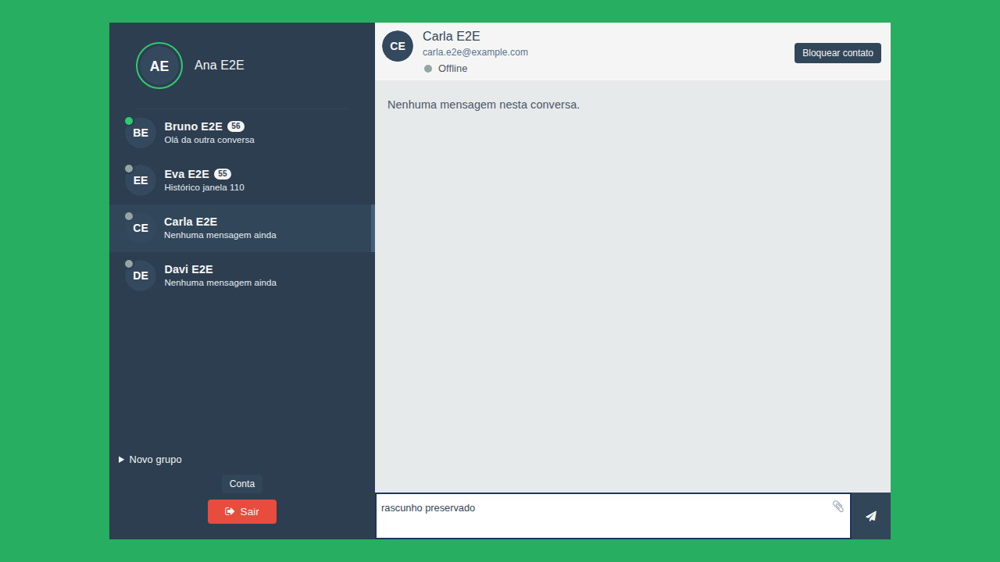

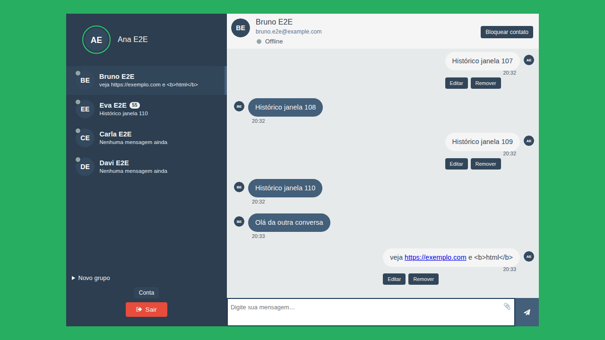

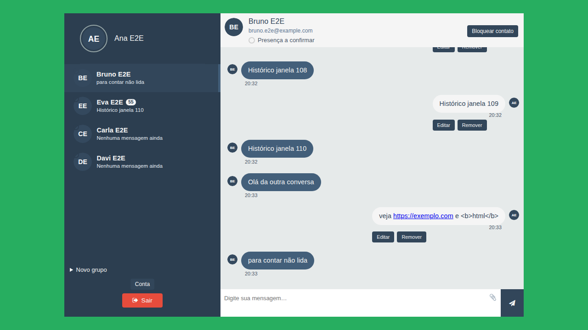

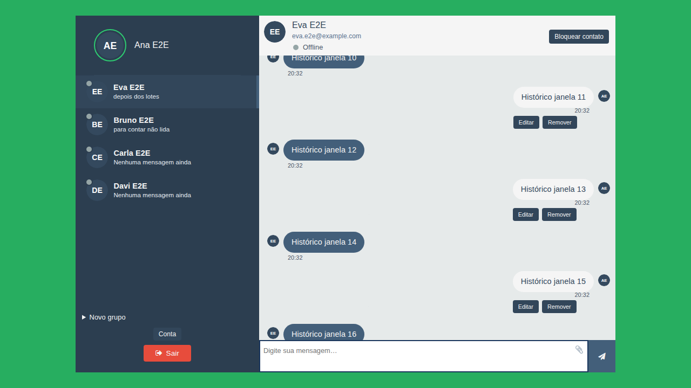

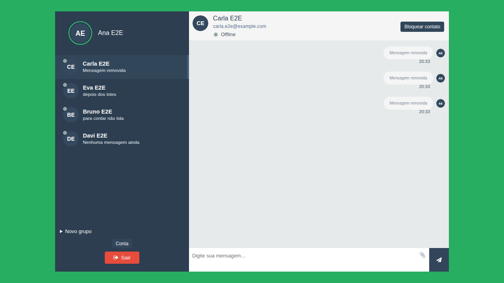

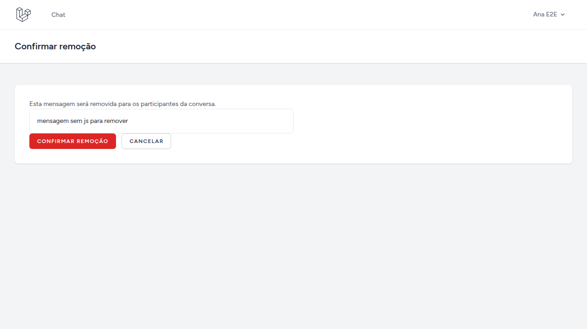

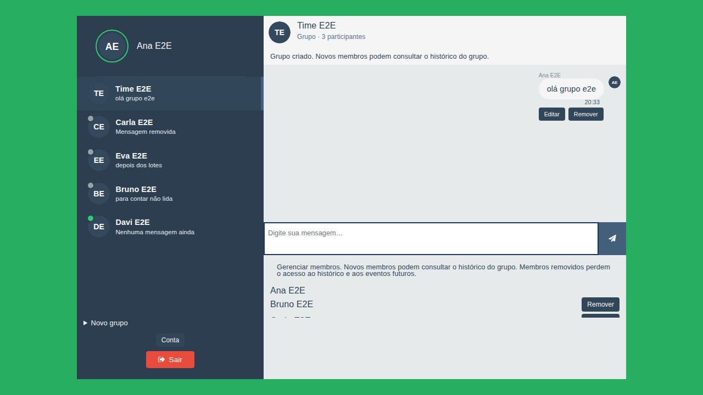

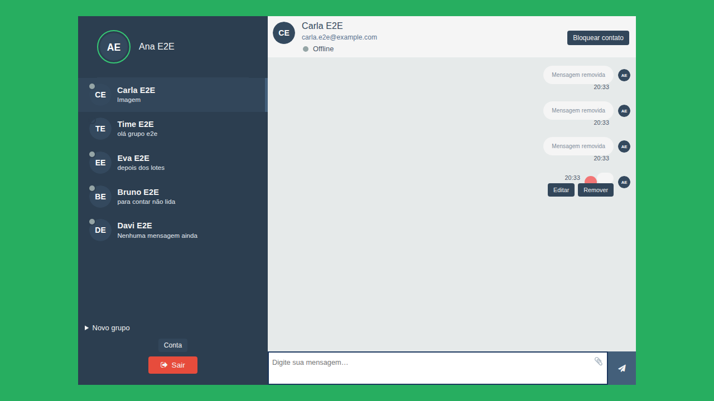

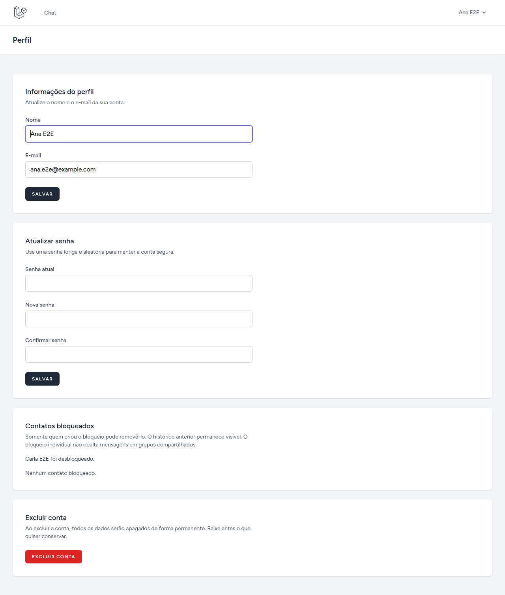

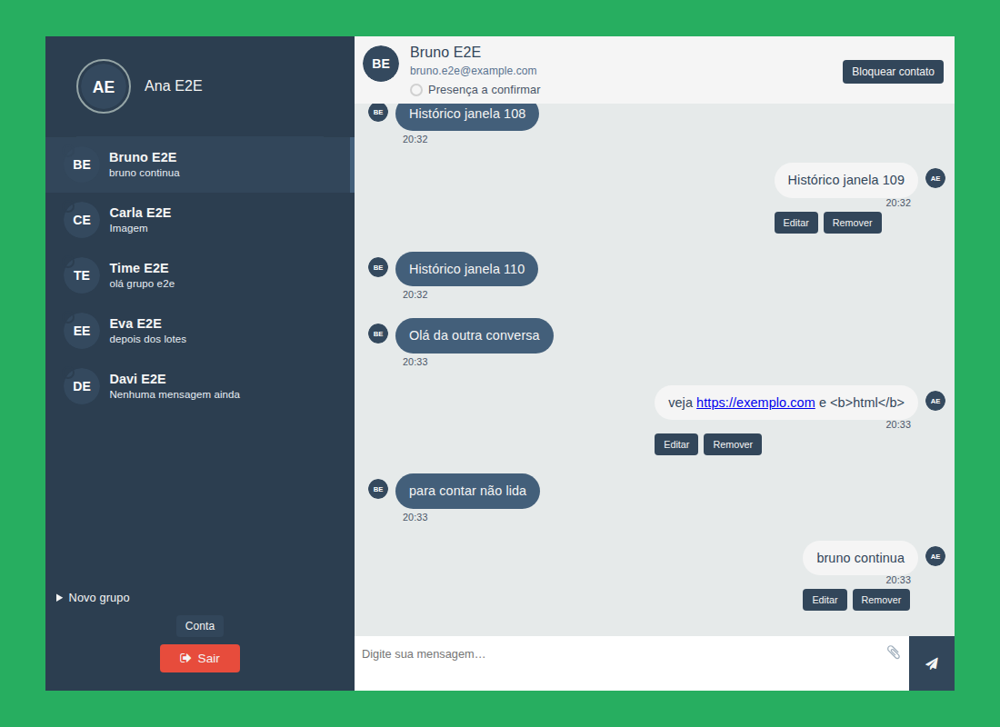

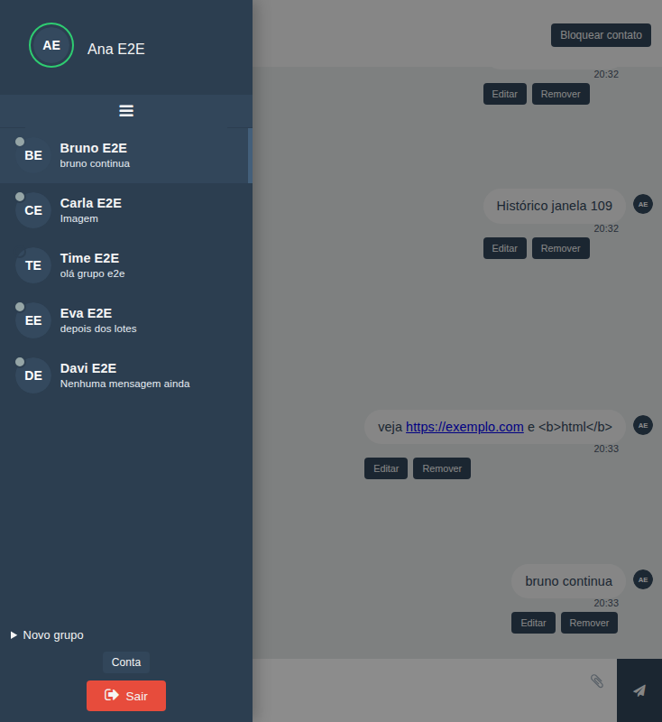

## Matriz dos 11 IDs

| ID | Implementação | Evidência | Limitações |
| --- | --- | --- | --- |
| N1-01 | Lista unificada, prévia, ordenação por `ultima_mensagem_em` | PHPUnit lista/edição; Playwright lista | — |
| N1-02 | Echo no canal do usuário; conversas novas entram na lista ao vivo | PHPUnit canais; Playwright `tempo-real.spec.ts` (evento `mensagem.enviada` no Pusher, sem GET `?versao=` e sem reload) | — |
| N1-03 | Textarea, Enter/Shift+Enter, IME, POST sem JS | PHPUnit HTML/POST; Playwright Shift+Enter e formulário com JS desativado | Teclado virtual nativo de aparelho e IME de SO não foram usados |
| N1-04 | `FormatadorMensagem` + JS equivalente | PHPUnit unitário e HTML; Playwright links | — |
| N2-01 | `POST /leituras`, badge, monotônico, grupos | PHPUnit GET sem mutar + marcador monotônico; Playwright aba oculta simulada + aba visível | `document.visibilityState=hidden` é simulação no Chromium, não janela minimizada do SO |
| N2-02 | `POST /digitacao` + evento backend | PHPUnit canais/bloqueio; Playwright indicador, expiração ~3 s, limpeza ao enviar e ao trocar | — |
| N2-03 | PATCH/DELETE autorizados; `confirm` no cliente; GET de confirmação sem JS | PHPUnit autor/terceiro/GET sem mutação; Playwright com e sem JS (cancelar e confirmar) | — |
| N2-04 | Janela 50 + `antes_id` + ordem cronológica no cliente; botão `hidden` respeitado | PHPUnit 110 mensagens (dois lotes); Playwright sequência visível, dois lotes, botão oculto na home/vazio/fim | — |
| N3-01 | Grupos; publicação só aos membros atuais | PHPUnit 3+1; Playwright membro já conectado não recebe a próxima mensagem; HTTP 4xx | — |
| N3-02 | Disco privado + rota autenticada | PHPUnit válido/inválido/limite/terceiro; Playwright prévia e exibição | — |
| N3-03 | Bloqueio nos dois sentidos; canal do usuário permanece | PHPUnit; Playwright recusa 4xx no 1:1 e mensagem de outro contato ao vivo | — |

## Requisitos

- Docker e Docker Compose
- Não é necessário PHP, Composer ou Node no host depois que o Sail estiver no ar (o Playwright isolado usa o PHP do host só na suíte e2e)
- Conta Pusher Channels (credenciais no `.env`; o secret nunca vai para o Vite)

## Identificação Docker

| Recurso | Nome |
| --- | --- |
| Projeto Compose | `chat` |
| Container da aplicação | `chat-app` |
| Imagem da aplicação | `chat-app:8.5` (PHP 8.5) |
| Container do banco | `chat-mysql` (MySQL 8.4) |
| Banco | `chat` |
| Rede | `chat` |
| Volume | `chat-mysql` |

Portas no host: aplicação **8000**, MySQL **33060**, Vite **5173**. O Proesc permanece em **8001**.

## Instalação com Sail

Na raiz do repositório, se ainda não houver `vendor/`:

```bash
docker run --rm -u "$(id -u):$(id -g)" \
  -v "$PWD":/opt -w /opt \
  laravelsail/php85-composer:latest \
  composer install --ignore-platform-reqs
```

Copie o ambiente e suba os containers:

```bash
cp .env.example .env
./vendor/bin/sail up -d
./vendor/bin/sail artisan key:generate
./vendor/bin/sail artisan migrate
```

Defina `DB_PASSWORD` no `.env` (não versionado) antes do `up`. Os demais valores de banco já apontam para o serviço `mysql` e o database `chat`.

Migrations incrementais desta entrega (não edite as já aplicadas):

- `2026_09_19_173342_create_conversas_e_evolucao_do_chat_tables`
- `2026_09_19_174921_make_destinatario_id_nullable_on_mensagens`

A primeira preserva mensagens existentes (IDs, autoria, conteúdo, datas) e cria conversas individuais. Não use `migrate:fresh` / `refresh` no banco `chat`.

## Pusher Channels

Preencha no `.env` (não versionado):

```env
BROADCAST_CONNECTION=pusher
PUSHER_APP_ID=
PUSHER_APP_KEY=
PUSHER_APP_SECRET=
PUSHER_APP_CLUSTER=
VITE_PUSHER_APP_KEY="${PUSHER_APP_KEY}"
VITE_PUSHER_APP_CLUSTER="${PUSHER_APP_CLUSTER}"
CHAT_PREFIXO_CANAL=
```

- Só `VITE_PUSHER_APP_KEY` e `VITE_PUSHER_APP_CLUSTER` vão para o frontend.
- **Nunca** exponha `PUSHER_APP_SECRET` em `VITE_*`, no repositório ou no Vite.
- Sem chave/cluster, o Echo **não conecta**; login, chat e logout seguem normais.
- `CHAT_PREFIXO_CANAL` vazio no desenvolvimento. Nos testes e2e vale `e2e-`, para não cruzar com sessões reais no mesmo app Pusher.
- Depois de preencher as credenciais:

```bash
./vendor/bin/sail npm run build
```

## Comandos

```bash
./vendor/bin/sail up -d
./vendor/bin/sail artisan test
./vendor/bin/sail npm run build
./vendor/bin/sail pint
npx playwright test -c tests/e2e/playwright.config.ts
bash tests/e2e/verificar-migracoes-mysql.sh
./vendor/bin/sail artisan chat:diagnostico-pusher {id-ou-email}
./vendor/bin/sail down
```

O Playwright sobe um servidor isolado em `http://127.0.0.1:8002` (SQLite, sessão em `SESSION_FILES`, disco `ANEXOS_PATH`, prefixo `e2e-`). Não usa o MySQL `chat`. O servidor e2e usa `php artisan serve --no-reload` com `PHP_CLI_SERVER_WORKERS=8`. Sem `--no-reload` o Laravel ignora os workers e serializa `/broadcasting/auth` com o POST das mensagens.

## Arquivos principais

- `app/Models/Conversa.php`, `ConversaParticipante.php`, `Mensagem.php`, `Bloqueio.php`
- `app/Services/ServicoConversa.php`, `ServicoLeitura.php`, `ServicoAnexo.php`, `ServicoBloqueio.php`, `MontadorListaConversas.php`
- `app/Http/Controllers/ChatController.php`, `MensagemController.php`, `GrupoController.php`, `LeituraController.php`, `DigitacaoController.php`, `BloqueioController.php`, `AnexoController.php`
- `app/Broadcasting/PublicadorMensagem.php`
- `resources/views/chat/index.blade.php`, `resources/js/chat.js`, `public/assets/style.css`
- `resources/views/profile/partials/contatos-bloqueados.blade.php`

## Testes: o que é simulado, local e Pusher real

- **PHPUnit** (`./vendor/bin/sail artisan test`): SQLite em memória, `Event::fake` para broadcast, HMAC local em `/broadcasting/auth`. Não fala com a nuvem do Pusher. Inclui instalação limpa e atualização incremental do esquema (`MigracaoEvolucaoChatTest`).
- **MySQL descartável** (`bash tests/e2e/verificar-migracoes-mysql.sh`): cria `chat_e2e_migracoes` e `chat_e2e_limpa` no MySQL do Sail, nunca no banco `chat`. Confere backfill (id, conteúdo, `created_at`) e instalação limpa; no fim apaga as duas bases. Nesta execução o banco `chat` permaneceu com 2 usuários (Yoshi, Carla) e 8 mensagens.
- **Playwright + Pusher real** (`npx playwright test -c tests/e2e/playwright.config.ts`): Chrome (`channel: 'chrome'`), 1 worker. Servidor :8002 isolado. Canais `e2e-App.Models.User.{id}`. Arquivos: `tests/e2e/evolucao.spec.ts`, `tests/e2e/tempo-real.spec.ts`, `tests/e2e/helpers.ts`. Contextos separados para contas diferentes; páginas do mesmo contexto para abas da mesma conta.
- **Evento Pusher vs HTTP:** `window.__chatDiagnostico.eventosPusher` registra o que chegou pelo Echo. `reconciliacoes` registra GET `/mensagens?versao=`. N1-02 ao vivo exige o evento Pusher e zero reconciliação extra. A reconciliação após disconnect exige HTTP e a ausência do `mensagem.alterada` no Pusher durante a queda.

### Não executado nesta entrega

- Teclado virtual nativo de um telefone físico e composição IME de um SO real (há guarda `compositionstart`/`isComposing` no cliente).
- Janela minimizada do sistema operacional. A leitura em segundo plano usa `document.visibilityState` simulado no Chromium.
- Plano comercial do Pusher ou client events.

### Roteiro manual (duas contas no app de desenvolvimento)

1. Navegador A: Yoshi, conversa com Carla.
2. Navegador B (anônimo): Carla. Confirme lista, não lidas, digitação, edição e bloqueio.
3. Crie um grupo com três pessoas e confirme que uma quarta não entra.
4. Envie uma imagem 1:1 e tente a URL do anexo deslogado ou com terceiro.

## URLs

- Aplicação: http://localhost:8000
- Login: http://localhost:8000/login
- Cadastro: http://localhost:8000/register
- Contato: http://localhost:8000/?contato={id}
- Grupo: http://localhost:8000/?grupo={id}
- Perfil / bloqueados: http://localhost:8000/profile
- Histórico JSON: http://localhost:8000/mensagens?contato={id} ou `?conversa={id}`
- Anexo autenticado: http://localhost:8000/mensagens/{id}/anexo

Visitantes são redirecionados ao login. O chat em `/` exige sessão autenticada.
